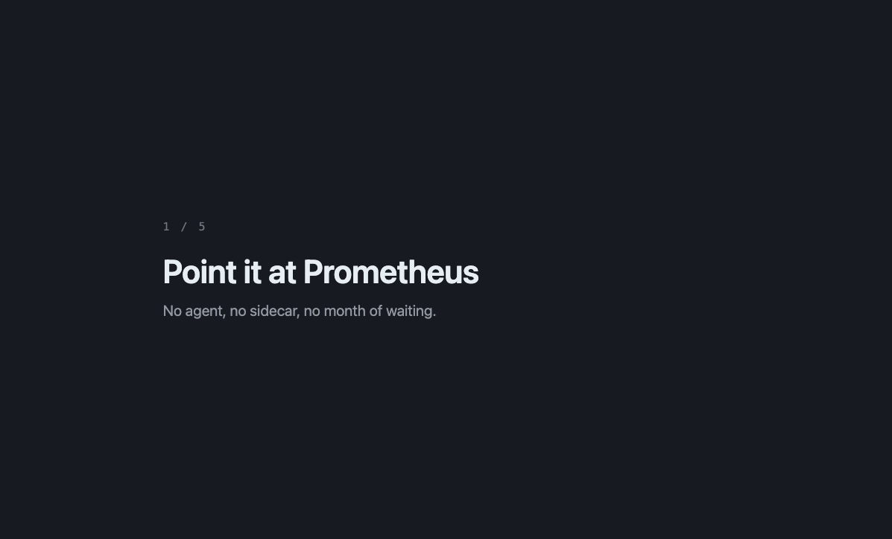

# jetsam

Finds the Prometheus metrics nothing reads, and proposes dropping them.

v0.2.0 -- see Limits for what it cannot see yet.

Prometheus tells you how many series each metric has. Your rules tell you
which metrics anything actually queries. jetsam joins the two and opens a
pull request against your scrape config for the difference.

Every recommendation names the queries it was checked against, so you can
redo the check by hand.



Recorded against [prometheus.demo.prometheus.io](https://prometheus.demo.prometheus.io)
with `demo/record.sh`. Every number in it is real.

## Install

```
go install github.com/SaiPisey2/jetsam/cmd/jetsam@latest
```

## Use

```
jetsam init                      # writes jetsam.yaml
$EDITOR jetsam.yaml              # set prometheus.url, and prometheus_file for propose
jetsam scan
jetsam propose -include-unreferenced
```

`propose` prints the pull request it would open -- the diff to your scrape
config and the PR body -- and opens nothing.

By default `propose` only ever proposes a metric backed by real evidence
that nothing reads it. With no dashboards and no query log configured that
means it proposes nothing at all -- `-include-unreferenced` is the escape
hatch for that install, and it means accepting a metric on faith (no rule
references it, but jetsam cannot see ad-hoc or Grafana Explore queries
against it):

```
jetsam propose -include-unreferenced
```

Configure `grafana.url` and `query_log.path` instead, and a metric earns
its drop on evidence: no rule or dashboard references it, and a query log
covering at least `query_log.min_window` shows nothing read it either. On
that install, plain `propose` -- no flag -- proposes drops on its own:

```
jetsam propose
```

The PR body states which grade every drop rests on, how many dashboards
were read, and how much of the query log's window backs an `unqueried`
verdict -- and carries an extra warning wherever a drop rests on
`unreferenced` instead. A non-empty set of unreadable rules, or a Grafana
that is configured but unreachable, still forbids every drop regardless of
`-include-unreferenced`.

`grafana.url` is optional and separate from the credential: set
`$GRAFANA_TOKEN` in the environment, never in `jetsam.yaml` or as a flag --
the same reasoning as `$GITHUB_TOKEN` below.

Add `-apply -owner OWNER -repo REPO` to actually open it, with a GitHub
token in `$GITHUB_TOKEN`:

```
export GITHUB_TOKEN=...
jetsam propose -apply -owner myorg -repo myrepo
```

Because of that, `-apply` opens nothing on a default install until you pass
`-include-unreferenced` or configure a qualifying query log (optionally
alongside `grafana.url`, which only ever narrows what looks unread).

The token is read from the environment only -- never accept it as a flag,
since a flag value lands in `ps` output and shell history. `-apply` without
`-owner`, `-repo`, or a token is refused before anything else runs.

## Aggregate

`propose` only ever drops a metric nothing reads. `jetsam aggregate` looks
at metrics something DOES read, but only through a few of their labels, and
reports which ones could be collapsed into a recording rule instead --
naming the rule, and the rewrite each consumer would need:

```
jetsam aggregate
```

It is a report, not an edit: no `-apply`, no rule file, no pull request.
Nothing it prints is written anywhere, and it says so on every run --
collapsing a metric for real means aggregating it upstream of Prometheus
(a collector, or stream aggregation), never dropping it at the scrape
config the way `propose` does. A recording rule cannot read a metric that
has already been dropped at ingest.

A metric only earns a name here when jetsam has actually measured the
saving against your Prometheus, every consumer of it is a rule agreeing on
the same operator and labels, and the saving clears
`aggregate.min_series_saved` (100 by default). Anything else is refused,
with the reason -- read by a dashboard jetsam cannot rewrite, consumers
that disagree, or a metric no rule aggregates at all. A metric your query
log recorded a read of is still proposed, not refused: that read is a
historical event, not a standing consumer, and its caveat is printed right
alongside the numbers, before the detail -- see Limits.

## Limits

- **Rules, dashboards and the query log are still not everything.** jetsam
  reads `/api/v1/rules`, every Grafana dashboard `grafana.url` can see, and
  the query log at `query_log.path`. It still cannot see ad-hoc queries run
  outside that log's window, `remote_read`, or anything scraping
  `/federate`. A metric read only through one of those looks unreferenced
  or, if it happens to also predate the log's window, unqueried in error.
- **A query log that also captures tooling stays honest.** Anything that
  probes your Prometheus with PromQL -- `mimirtool analyze prometheus`,
  jetsam's own `aggregate` measurement query and job-membership check --
  gets logged exactly like a human's query. jetsam tags its own queries
  with the established `__ignore_usage__` label and skips any logged query
  carrying it, whoever issued it, so a metric a tool merely probed does not
  look read and running `aggregate` once does not change what `propose`
  sees on the next run.
- **The query log records PromQL queries, not reads.** Prometheus'
  `global.query_log_file` logs what its query ENGINE evaluated. A metric
  read through `/api/v1/label/<name>/values` or `/api/v1/series` never
  appears in it — and that is how Grafana resolves a dashboard's template
  variables, and what Explore's metric browser uses. On an install with
  `query_log.path` set and `grafana.url` unset, such a metric is absent
  from the corpus, grades `unqueried`, and plain `jetsam propose` proposes
  dropping it. Configuring `grafana.url` is what covers that case, because
  jetsam then reads those variable queries from the dashboards themselves;
  `jetsam scan` warns when the log is configured and Grafana is not.
- **jetsam sees the dashboards its token can see.** Grafana's search API
  is paginated and jetsam pages through all of it, but a service-account
  token without permission on every folder returns a subset, with no
  indication that it did. Give the token organisation-wide dashboard read
  access, or metrics referenced only by an invisible folder's dashboards
  will look unread.
- **Nothing is proposed without evidence.** See `-include-unreferenced`
  above. Without a qualifying query log, every unread metric is graded
  `unreferenced`, which never auto-proposes.
- **Grafana configured but unreachable withholds every drop.** `scan`
  still runs and still grades from rules, but "no dashboard reads it" and
  "nobody looked" produce identical numbers, so nothing is proposed until
  Grafana answers again -- `-include-unreferenced` does not override this.
- **A query log that cannot be read withholds every drop.** `scan` still
  runs and still grades from rules and dashboards, but an unreadable log
  is the absence of negative evidence, not evidence of absence -- so
  nothing is proposed until it reads again, `-include-unreferenced`
  included. jetsam says so on stderr and in the report rather than
  exiting.
- **`min_window` is a Go duration, not a calendar one.** `720h`, not
  `30d` -- `d` is not a Go duration unit and `jetsam.yaml` fails to parse
  rather than silently treating the minimum as zero. A negative value is
  refused outright, since `Span >= -1h` would qualify an empty log.
- **One unreadable rule blocks every drop.** A rule jetsam cannot parse
  might reference anything, so nothing is proposed until it is fixed.
  `jetsam scan` names which.
- **The inventory can be truncated.** `prometheus.metric_limit` caps how
  many metric names are graded. When it truncates, jetsam says so in both
  the report and the pull request -- but metrics outside the cap are simply
  not considered.
- **The generated diff normalises YAML layout.** Blank lines between scrape
  configs are dropped and indentation is normalised to two spaces. The dry
  run prints the exact diff; read it before `-apply`.
- **Reverting restores collection, not history.** Series not written while
  a drop rule is live cannot be recovered.
- **`-apply` has never opened a real pull request.** The branch, the
  stale-blob refusals and the "do not reopen a closed PR" behaviour are
  tested against a fake forge and a stubbed GitHub API, and the dry run is
  correct against real scrape configs. Only the live write path is
  unproven.
- **Resolving each candidate's job is one Prometheus query.** Against a
  1374-metric instance, resolving every candidate returned by
  `-include-unreferenced` takes about 26 seconds -- this runs concurrently,
  not one query at a time.
- **A dashboard refuses `aggregate`; a logged query only caveats it.** A
  dashboard keeps reading for as long as it exists and jetsam cannot edit
  Grafana, so it withholds the proposal outright. A query the log recorded
  is a historical event, not a standing consumer -- its labels already
  count toward the safety check, so `aggregate` still proposes the metric
  and names the query in a caveat instead: re-running it later is not
  guaranteed to return what it did.

## License

Apache 2.0.
